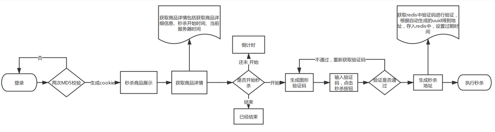

# msProject
基于SpringBoot、mybatis、redis、RabbitMQ的秒杀系统。 前后端进行分离，使用ajax进行访问后端接口，获取数据。   
-  前端： jquery,thymeleaf
-  后端数据库: Springboot,Mybatis  
-  中间件: Redis,RabbitMQ  

## 项目流程
1. 从登录到执行秒杀的流程

2. 执行秒杀流程  

## 展示

## 秒杀接口优化

- redis预减库存减少数据库访问

  - 系统初始化，把商品库存数量加载到redis
  - 收到请求，redis预减库存，库存不足，直接返回 
  - 库存还有，请求入队，返回排队中 

- 内存标记减少redis访问

  设置一个map,来存储当前商品是否已经结束秒杀。若已经结束，则直接返回，不访问redis

- 请求先入队缓存，异步下单

- 请求出队，生成订单，减少库存

- 客户端轮询，是否秒杀成功
## 安全优化

- 秒杀接口地址隐藏

  - 秒杀开始之前，先去请求接口获取秒杀地址
    1. 接口改造，带上PathVariable参数
    2. 添加生成地址的接口
    3. 秒杀收到请求，先验证PathVariable

- 数学公式验证码

  - 点击秒杀之前，先输入验证码，分散用户的请求
    1. 添加生成验证码的接口
    2. 在获取秒杀路径的时候，验证验证码
    3. ScriptEngine使用

- 接口限流防刷

  自定义标签@AccessLimit，自定义拦截器，获取方法上的@AccessLimit以此来达到接口限流的目的
